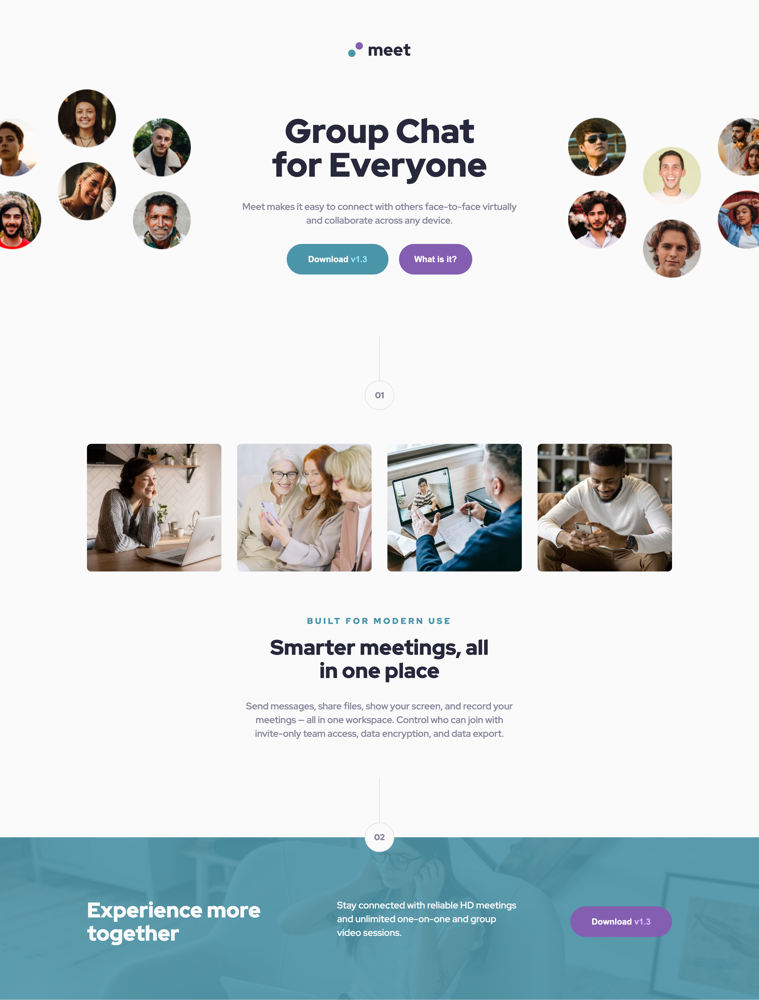
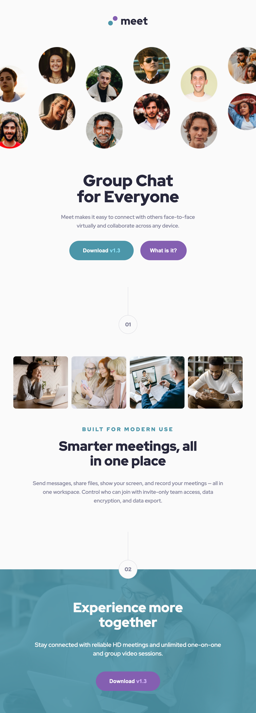

# Frontend Mentor - Meet landing page solution

This is a solution to the [Meet landing page challenge on Frontend Mentor](https://www.frontendmentor.io/challenges/meet-landing-page-rbTDS6OUR). Frontend Mentor challenges help you improve your coding skills by building realistic projects.

## Table of contents

- [Overview](#overview)
  - [Screenshot](#screenshot)
  - [Links](#links)
- [My process](#my-process)
  - [Built with](#built-with)
- [Author](#author)

## Overview

### Screenshot

### Links

- Solution URL: [https://github.com/NunoAzevedo17/meet-landing-page](https://github.com/NunoAzevedo17/meet-landing-page)
- Live Site URL: [https://nunoazevedo17.github.io/meet-landing-page](https://nunoazevedo17.github.io/meet-landing-page)

## My process

### Built with

- HTML
- SCSS

## Author

- Website - [nunoazevedo.vercel.app](https://nunoazevedo.vercel.app)
- Frontend Mentor - [@NunoAzevedo17](https://www.frontendmentor.io/profile/NunoAzevedo17)
